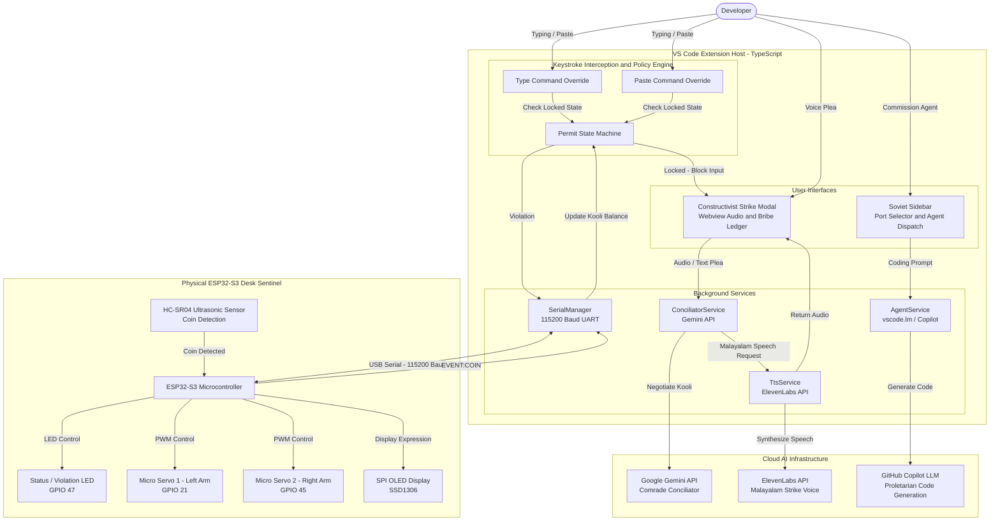
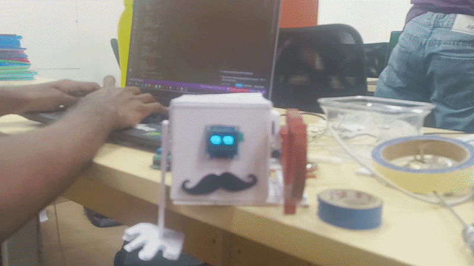
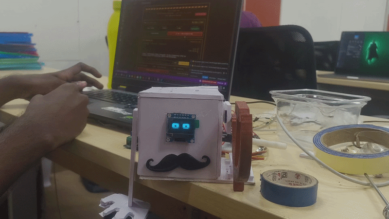

# NOKKUKOOLI 


## Basic Details
### Team Name: Union leader

### Team Members
- Team Lead: Alen Elias Cherian - Cochin University College of Engineering Kuttanad
- Member 2: Amith Biju - Cochin University College of Engineering Kuttanad

### Project Description
**NOKKUKOOLI** is a satirical hardware-and-software apparatus inspired by the notorious Kerala concept of **“നോക്കുകൂലി”** (*looking-on charges* or *gawking wages*), transplanted into the 2026 AI developer era.

**NOKKUKOOLI ** turns this idea into a ridiculous desktop coding-agent experience: **you pay the agent for watching you work, not for doing the work.**

Instead of a union worker standing by and demanding payment, NOKKUKOOLI uses a **desktop robotic sentinel representing your coding agent**. The sentinel demands **കൂലി (kooli)** simply for allowing you to work.

**Drop a coin →** the sentinel becomes happy and lets you continue coding.
**Don't pay →** it becomes angry, raises its arms, and demands its kooli.
**Try to bargain →** you can negotiate with the sentinel to reduce the demanded amount.

The result is an intentionally ridiculous combination of **AI, hardware, and Kerala's Nokkukooli satire**—a coding agent that gets paid for simply watching you work while doing none of the heavy lifting.


### The Problem (that doesn't exist)
Modern coding agents are designed to do the work for developers, but nobody has built one that demands payment for simply watching them work.

**Inspired by Kerala's satirical concept of നോക്കുകൂലി (Nokkukooli),** the challenge is to create a playful desktop system where a coding-agent sentinel demands kooli before allowing the developer to continue working. If the payment is skipped, the sentinel becomes angry and demands its due—while giving the developer the opportunity to bargain and negotiate the kooli.

**The problem:** How can we turn the absurd idea of paying an agent simply for watching you code into an interactive hardware-and-software experience?

### The Solution (that nobody asked for)
A desktop toy that acts as the coding agent's Nokkukooli representative. It collects the agent's കൂലി (kooli) through a coin drop and reacts to whether you pay.

Pay the kooli → the sentinel becomes happy and lets you work.
Don't pay → it becomes angry, raises its arms, and demands payment.
Try to bargain → negotiate with the sentinel to reduce the kooli and get back to work.

It's an unnecessarily physical way of turning നോക്കുകൂലി into a hilarious interaction between you and your coding agent.

## Technical Details
### Technologies/Components Used
For Software:
- Languages used: C++, Arduino, Python/JavaScript (Host side serial listener)
- Frameworks used: Arduino IDE / ESP32 Core 3.x
- Libraries used: Adafruit GFX, Adafruit SSD1306, SPI
- Tools used: Git, VS Code, PlatformIO / Arduino CLI

For Hardware:
- Microcontroller: Freenove ESP32-S3 Board
- Display: 128x64 SPI OLED Display (SSD1306 driver)
- Sensors: HC-SR04 Ultrasonic Distance Sensor
- Actuators: 2x Micro Servo Motors (Articulated Arms)
- Indicators: Piezo mist generator module (Pin 47)

### Implementation
For Software:
# Installation

1. Clone the repository and open the project folder.
2. Flash the firmware from the `firmware/` folder onto the ESP32-S3 using **ESP-IDF**.
3. Install the **Kammi-AI VS Code extension** from the `extension/` folder and install its dependencies:

   ```bash
   cd extension
   npm install
   npm run compile
   ```
4. Configure the required API keys by copying `.env.example` to `.env.local` and adding your **Gemini** and **ElevenLabs** keys.
5. Connect the ESP32-S3 to your computer via USB and identify the **COM/serial port** assigned to the device.

# Run

1. Start the ESP32-S3 with the firmware flashed from the `firmware/` folder.
2. Open the project in VS Code and press **`F5`** to launch the **Extension Development Host**.
3. Select the **serial/COM port connected to the NOKKUKOOLI sentinel** from the extension.
4. Open any code or text file and start working.
5. The  extension communicates with the physical sentinel through the selected serial port.
6. Pay the **കൂലി (kooli)** using the coin-drop mechanism to keep the sentinel happy. If you skip the payment or trigger a violation, the sentinel enters **Angry Mode** with flashing LEDs and raised arms.
7. You can even **bargain with the agent** to reduce the demanded kooli.


## Project Documentation
                      
For Hardware:
# Diagram
### Architecture



# Schematic & Circuit Connections


         Schematic Diagram: Physical pinout layout of the Freenove ESP32-S3 microcontroller and its interconnected peripherals.
         
### screenshots
#### vs code extension 


#### TOY IMG


# Build Photos

 DEMO TEST 1
 
 

  DEMO  TEST 2
  
   


#### Components pictuer


  -> list of components used
  
    Freenove ESP32-S3 Microcontroller Board (Quantity: 1)

    128x64 SPI OLED Display - SSD1306 driver (Quantity: 1)

    HC-SR04 Ultrasonic Distance Sensor (Quantity: 1)

    Micro Servo Motors (Quantity: 2)

    Piezo Mist Generator Module (Quantity: 1)
-> Final build


Build Journey Video: https://drive.google.com/drive/folders/10kj9D-wRr1ZJJ6Q2odVD12QUhY3tBbYD?usp=sharing


### Project Demo
# Video
[*(Link to video demo *](https://drive.google.com/drive/folders/1n8Yt4mt-epqzKZ2gL3_OR2DlSLlJ87M2?usp=sharing)

# Additional Demos
**Want to know what nookukooli is all about and why we built this chaotic little machine?** Head over to the documentation on our site (nokkukooli-live.vercel.app) to dive into the legendary Kerala inspection culture, see how we brought the ultimate "gazing fee" to your desk, and find out why we willingly chose to build the most counter-productive coding sentinel ever made.

[nokkukooli-live.vercel.app](https://nokkukooli-live.vercel.app/)

## Team Contributions
- Amith Biju - Software architecture, state machine logic, non-blocking sensor implementation, and serial interface.
- Alen Elias Cherian - Hardware assembly, circuit schematics, physical chassis construction, and servo/sensor integration.

---
Made with ❤️ at TinkerHub Useless Projects 


